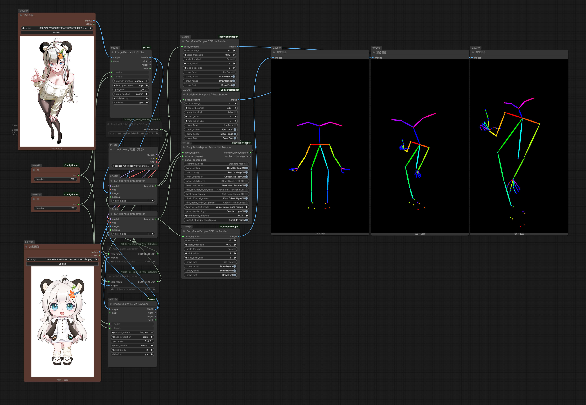

# ComfyUI-BodyRatioMapper

[中文](./README_ZH.md) | [English](./README.md)

A project for pose alignment and human body proportion mapping based on SDPose.

## Introduction

The core goal of `ComfyUI-BodyRatioMapper` is to match the "target motion" to the "reference body shape," then align and rescale the target pose relative to the reference. This project is also the first of its kind to support multi-person scenarios.

Typical use cases:

- Preprocessing for human motion transfer in images or videos
- Generating keypoint sequences with consistent body proportions

## Features

- Pose Alignment
- Body Ratio Mapping
- Built-in keypoint rendering nodes for visual inspection
- Multi-person support

## Results

### Single-Image Examples

- Workflow example:



- Comparison result:


### Video Examples

Single-person comparison:

https://github.com/user-attachments/assets/7b1087a6-a2a3-4885-b266-a9ce76837c85

https://github.com/user-attachments/assets/0dde62cf-17a0-45c6-9898-849841c310fd

Multi-person comparison:

https://github.com/user-attachments/assets/b2ca9b26-0dae-4514-ae05-4e4fccdc2cfe

### Comparison Summary

Tests show that aligning body skeletons to a reference significantly improves character consistency in motion transfer.  
Compared with similar methods (such as One To All animation and ProportionChanger), this project performs better.  
All tests were run with SteadyDancer under identical settings, including random seed.

## Installation

Clone this repository into ComfyUI's `custom_nodes` directory and install dependencies:

```bash
cd ComfyUI/custom_nodes
git clone https://github.com/wuwukaka/ComfyUI-BodyRatioMapper.git
cd ComfyUI-BodyRatioMapper
pip install -r requirements.txt
```

Restart ComfyUI after installation.

## Quick Start

1. Launch ComfyUI and make sure this plugin is loaded.
2. Example workflows require ComfyUI `0.16.1` or newer.
3. Import the example workflows:
`example_workflows/bodyratiomapper_officail_sdpose_image.json`
`example_workflows/bodyratiomapper_officail_sdpose_video.json`

## Node Description

### 1. BodyRatioMapper Proportion Transfer

- Node name: `BodyRatioMapperProportionTransfer`
- Purpose: Performs pose alignment and body proportion mapping, then outputs transformed keypoints and anchor keypoints.
- Main inputs:
`pose_keypoint`
`ref_pose_keypoint`
`manual_anchor_pose`
- Common parameters:
`alignment_mode`, `hand_scaling`, `foot_scaling`, `offset_stabilizer`, `confidence_threshold`, `output_absolute_coordinates`
- Outputs:
`changed_pose_keypoint`, `anchor_pose_keypoint`

### 2. BodyRatioMapper SDPose Render

- Node name: `BodyRatioMapperSDPoseRender`
- Purpose: Renders keypoints as a skeleton image.
- Common parameters:
`resolution_x`, `score_threshold`, `stick_width`, `face_point_size`, `draw_face`, `draw_hands`, `draw_feet`
- Output: `IMAGE`

### 3. pose_keypoint input

- Node name: `PoseJSONToPoseKeypoint`
- Purpose: Converts a JSON string into `POSE_KEYPOINT`, useful for manual debugging or external keypoint input.

### 4. pose_keypoint preview

- Node name: `PoseKeypointPreview`
- Purpose: Converts `POSE_KEYPOINT` into JSON text and displays it in-node for copying, inspection, and round-tripping.

## Project Structure

```text
ComfyUI-BodyRatioMapper/
├─ body_ratio_mapper/
│  ├─ core_modules/
│  ├─ proportion_transfer_node.py
│  └─ render_nodes.py
├─ web/js/poseKeypointPreview.js
├─ example_workflows/
├─ docs/
├─ nodes.py
├─ requirements.txt
├─ pyproject.toml
└─ __init__.py
```

## FAQ

### 1. Nodes do not appear after installation

- Confirm the repository path is `ComfyUI/custom_nodes/ComfyUI-BodyRatioMapper`
- Check whether dependencies were installed successfully
- Restart ComfyUI and check startup logs for errors

### 2. Keypoints are empty or look abnormal

- Verify the input is valid `POSE_KEYPOINT`
- Lower `confidence_threshold` if needed
- Use `pose_keypoint preview` to inspect whether the keypoint JSON is complete

## Acknowledgements

- Some code is derived from `grmchn/ComfyUI-ProportionChanger`:
https://github.com/grmchn/ComfyUI-ProportionChanger
- Special thanks to my friends 望星铭 (https://space.bilibili.com/13066617) and 阿临 (https://space.bilibili.com/20848068) for providing OC test assets.

## License

Since part of the code is derived from the GPL v3.0 project `ComfyUI-ProportionChanger`, this project is also released under **GPL v3.0**.


